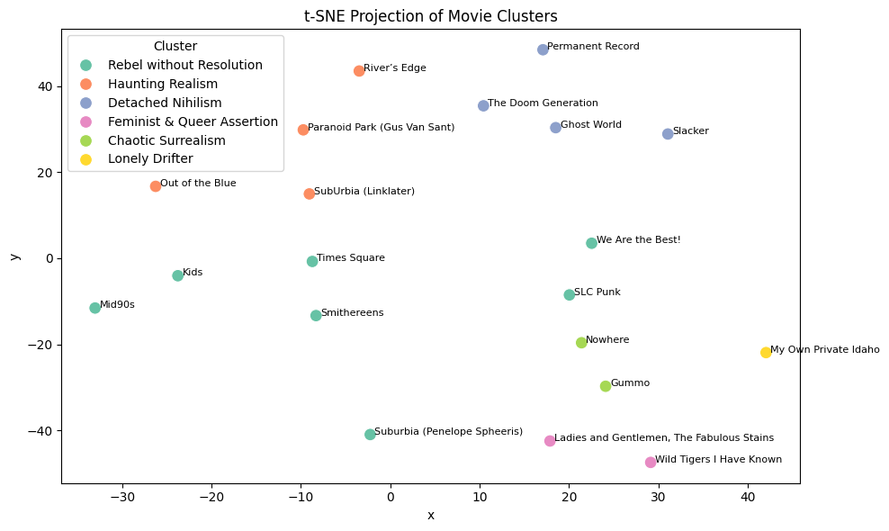

# punk-narrative-soundtrack
This project explores **emotional arcs and narrative structures** in cult and coming-of-age films with punk, anarchist, or nihilist elements — using their **soundtracks** as the emotional proxy.

## Motivation
Movies tell stories through music, especially in punk, alternative, and indie films, where raw and genre-driven soundtracks shape the emotional fabric of a scene. These rebellious and emotionally rich (or introspective) films don’t just entertain; they push back, reflect angst, and speak to identity and disillusionment. But what exactly are they telling us? What values, moods, and messages are embedded in their soundscapes?

This project explores how we can model those emotions quantitatively, using soundtrack metadata, inferred audio features (valence, energy, danceability, tempo), and time series analysis—to map the emotional arcs of cult and countercultural cinema.

## Emotional Landscape
The map below clusters 20 cult punk and indie films based on the emotional shape of their soundtracks. Each point represents a film; clusters capture shared arcs and values, from “Detached Nihilism” to “Chaotic Surrealism”.

*Each cluster reveals a distinct narrative mood shaped by emotional dynamics in the soundtrack.*

## Features
- 20 niche movie list curation (punk, anarchist, nihilist, urban decay, coming-of-age, indie, low-budget)
- IMDb soundtrack scraping and cleaning
- Track title + artist extraction, including edge cases (e.g., remixers, missing performers)
- Genre tagging (based on artist metadata through Spotify APIs)
- Audio feature inference by genre using curated JSON mappings (183 music genres)
- Normalization + time series interpolation of emotional features per film
- PCA & KMeans clustering optimization
- Visualization using t-SNE 
- Cluster-based analysis of emotional archetypes
- Exported datasets and genre mappings

## Credits
Project by Yiran Ren (xeveryr14x @github)

Built using data from IMDb, Spotify, and genre-based acoustic mappings.

## License
This project is for academic/educational use only. Not affiliated with IMDb or Spotify.
